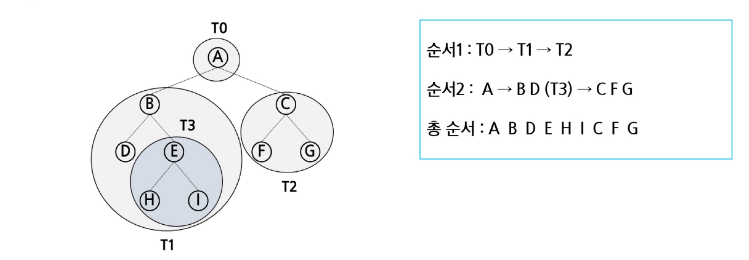
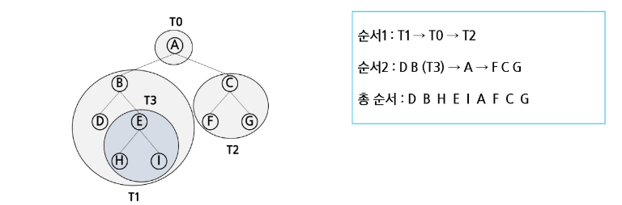
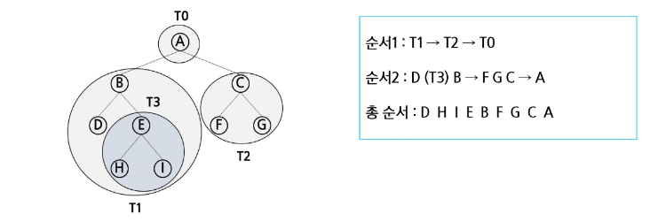

# 📝 [TIL] 알고리즘 - 이진 트리 순회(Traversal)와 수식 트리

> **"트리의 모든 노드를 중복 없이, 빠짐없이 방문하는 여정"**

## 1. 순회(Traversal)란?

배열이나 연결 리스트 같은 선형 자료구조는 그냥 인덱스 0부터 끝까지 쭉 읽으면 된다. 하지만 트리는 **비선형 구조**이기 때문에, "어느 쪽 가지로 먼저 갈 것인가?"에 대한 명확한 규칙(순서)이 필요하다.

이를 위해 부모 노드(V), 왼쪽 자식(L), 오른쪽 자식(R)을 방문하는 순서에 따라 3가지 기본 순회 방식을 사용힌다.

---

## 2. 3가지 기본 순회 방법 ★ (V의 위치가 이름을 결정한다)

순회의 이름은 **"부모 노드(V)를 언제 방문하느냐"**에 따라 결정된다. 항상 왼쪽(L)이 오른쪽(R)보다 먼저다.

| 순회 방식 | 방문 순서 | 핵심 특징 |
| --- | --- | --- |
| **전위 순회 (Preorder)** | **V** $\rightarrow$ L $\rightarrow$ R | 부모를 **가장 먼저** 방문. (루트 노드가 맨 앞에 옴) |
| **중위 순회 (Inorder)** | L $\rightarrow$ **V** $\rightarrow$ R | 부모를 **중간에** 방문. (왼쪽 다 보고, 나 보고, 오른쪽 봄) |
| **후위 순회 (Postorder)** | L $\rightarrow$ R $\rightarrow$ **V** | 부모를 **가장 나중에** 방문. (자식들 다 처리한 후 루트를 봄) |

### ① 전위 순회 (Preorder Traversal: VLR)

* **순서**: 현재 노드 방문 $\rightarrow$ 왼쪽 서브트리 순회 $\rightarrow$ 오른쪽 서브트리 순회
* **쓰임새**: 트리를 복사하거나, 구조를 그대로 출력할 때 주로 사용한다.

### ② 중위 순회 (Inorder Traversal: LVR)

* **순서**: 왼쪽 서브트리 순회 $\rightarrow$ 현재 노드 방문 $\rightarrow$ 오른쪽 서브트리 순회
* **쓰임새**: **이진 탐색 트리(BST)**에서 중위 순회를 하면 오름차순으로 정렬된 값을 얻을 수 있다.

### ③ 후위 순회 (Postorder Traversal: LRV)

* **순서**: 왼쪽 서브트리 순회 $\rightarrow$ 오른쪽 서브트리 순회 $\rightarrow$ 현재 노드 방문
* **쓰임새**: **디렉토리 용량 계산**이나 **트리 삭제**에 사용된다. (하위 폴더/자식 노드를 모두 처리해야 부모를 지우거나 계산할 수 있기 때문이다.)

---

## 3. 실전! 재귀를 이용한 순회 구현 (Python 템플릿)

이론을 보았으니 코드로 어떻게 돌아가는지 확인해야 한다. 놀랍게도 **`print()` 함수의 위치만 바꾸면** 3가지 순회가 모두 완성된다.

*(이 코드는 코테에서 트리를 탐색할 때 100% 쓰이는 기본 뼈대임.)*

```python
# tree: 인덱스는 부모 노드 번호, 값은 [왼쪽 자식, 오른쪽 자식]
# 예: tree[1] = [2, 3] (1의 왼쪽 자식 2, 오른쪽 자식 3)

# 1. 전위 순회 (VLR)
def preorder(node):
    if node != 0: # 0은 노드가 없음을 의미한다고 가정
        print(node, end=' ') # (V) 방문!
        preorder(tree[node][0]) # (L) 왼쪽으로 깊이 파고듦
        preorder(tree[node][1]) # (R) 오른쪽으로 깊이 파고듦

# 2. 중위 순회 (LVR)
def inorder(node):
    if node != 0:
        inorder(tree[node][0])  # (L) 왼쪽 서브트리 끝까지 감
        print(node, end=' ') # (V) 방문!
        inorder(tree[node][1])  # (R) 오른쪽 서브트리 감

# 3. 후위 순회 (LRV)
def postorder(node):
    if node != 0:
        postorder(tree[node][0]) # (L) 왼쪽 먼저
        postorder(tree[node][1]) # (R) 오른쪽 다음
        print(node, end=' ')  # (V) 마지막에 방문!

```

---

## 4. 수식 트리 (Expression Tree)

순회의 원리가 가장 완벽하게 적용되는 실생활(컴퓨터 공학) 예시입니다. 수학 수식을 이진 트리로 표현한 것이다.

### 🔹 수식 트리의 구조

* **가지 노드 (내부 노드)**: 연산자 (`+`, `-`, `*`, `/`)
* **잎 노드 (단말 노드)**: 피연산자 (숫자나 변수)

### 🔹 수식 트리를 순회하면 어떻게 될까?

같은 트리라도 **어떤 순회 방식을 쓰느냐에 따라 수식의 표기법이 달라진다.** (예: `A + B` 트리)

1. **전위 순회 (VLR)**: `+ A B` (전위 표기법, Prefix)
2. **중위 순회 (LVR)**: `A + B` (중위 표기법, Infix - 우리가 평소에 쓰는 수식)
3. **후위 순회 (LRV)**: `A B +` (후위 표기법, Postfix - 컴퓨터나 스택 계산기가 좋아하는 수식)

> 💡 **참고**: 후위 순회를 사용하면 괄호 없이도 연산의 우선순위를 완벽하게 표현할 수 있어서, 컴파일러가 수식을 계산할 때 후위 순회(LRV)를 적극 활용한다.

---

✅ **마무리 점검**
트리의 3가지 기본 순회 방식과 수식 트리의 관계를 정리했다. 코딩 테스트에서 "후위 순회한 결과를 출력하라"는 문제가 나오면, 당황하지 않고 재귀 함수의 맨 마지막에 `print()`를 찍어주면 된다.
