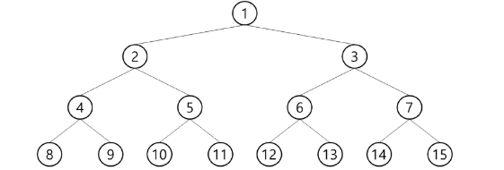
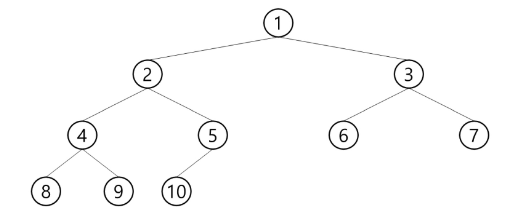
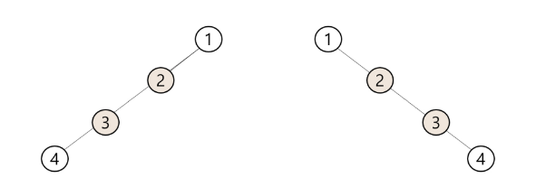

# 📝 [TIL] 알고리즘 - 이진 트리(Binary Tree) 완벽 이해

> **"모든 노드가 최대 2개의 갈림길만 가지는 가장 효율적인 트리"**

## 1. 이진 트리(Binary Tree)의 개념과 특성

* **정의**: 모든 노드들이 **최대 2개**의 서브 트리(왼쪽 자식, 오른쪽 자식)를 갖는 특별한 형태의 트리이다. (자식이 없거나 1개만 있어도 이진 트리다.)
* **수학적 특성**:
* 레벨 $i$에서의 노드의 최대 개수 = $2^i$ 개 (레벨이 0부터 시작할 때)
* 높이가 $h$인 이진 트리가 가질 수 있는 노드의 최대 개수 = $2^{h+1} - 1$ 개


---

## 2. 이진 트리의 3가지 주요 형태 ★ (그림 필수 암기)

알고리즘 문제 지문에서 트리의 형태를 명시하는 경우가 많으므로, 각 트리의 모양을 정확히 구별해야 한다.

### ① 포화 이진 트리 (Full Binary Tree)

* **특징**: 모든 레벨에 노드가 꽉꽉 빈틈없이 차 있는 이진 트리.
* **노드 수**: 높이가 $h$일 때, 정확히 $2^{h+1} - 1$ 개의 노드를 가진다.

### ② 완전 이진 트리 (Complete Binary Tree) ★ 가장 중요

* **특징**: 포화 이진 트리처럼 꽉 차 있지는 않지만, **위에서 아래로, 왼쪽에서 오른쪽으로** 빈자리 없이 차곡차곡 채워진 트리.
* **조건**: 중간에 이빨이 빠진(건너뛴) 노드가 없어야 한다. (힙 자료구조의 기본 형태)

### ③ 편향 이진 트리 (Skewed Binary Tree)

* **특징**: 한쪽 방향(왼쪽 또는 오른쪽)으로만 자식 노드를 계속 가지는 트리.
* **단점**: 사실상 1차원 배열(선형 구조)과 다를 바 없어, 트리 구조의 장점(빠른 탐색)을 전혀 살리지 못한다.

---

## 3. 이진 트리를 코드로 구현하는 방법

그래프의 인접 리스트처럼, 트리도 컴퓨터 메모리에 저장하는 방법이 필요하다. 크게 **배열**을 이용하는 방법과 **연결 리스트**를 이용하는 방법으로 나뉜다.

### 💡 방법 1: 노드 번호의 수학적 성질을 이용한 배열 1차원 표현 (완전 이진 트리에 적합)

루트 노드에 1번을 부여하고, 위에서 아래로, 왼쪽에서 오른쪽으로 번호를 매기면 마법 같은 수학적 규칙이 생긴다.

* **노드 번호 공식 (암기 필수)**:
* 현재 노드의 번호가 $i$ 일 때,
* **부모 노드 번호** = $i // 2$  (몫 연산)
* **왼쪽 자식 번호** = $2i$
* **오른쪽 자식 번호** = $2i + 1$


**[치명적 단점]**: 편향 이진 트리일 경우, 규칙을 맞추기 위해 배열을 크게 만들어야 하므로 **엄청난 메모리 낭비**가 발생한다. (예: 노드는 4개인데 오른쪽으로만 뻗으면 인덱스 15번까지 배열을 만들어야 함)

---

### 💡 방법 2: 부모-자식 관계를 직접 배열에 저장 (A형 실전용)

정해진 노드 번호 규칙이 없거나 빈자리가 많은 일반적인 이진 트리에서 가장 많이 쓰는 방식이다.

**[입력 예시]**: 정점의 개수 $V=5$, 간선 정보 `1 2 1 3 3 4 3 5` (부모-자식 순)

```python
V = 5
# 1. 자식 번호를 저장하는 배열 (왼쪽, 오른쪽)
left_child = [0] * (V + 1)
right_child = [0] * (V + 1)

# 2. (선택) 조상을 찾기 위해 부모 번호를 저장하는 배열
parent_arr = [0] * (V + 1)

edges = [1, 2, 1, 3, 3, 4, 3, 5]
for i in range(0, len(edges), 2):
    p, c = edges[i], edges[i+1]
    
    # 부모(p)의 자식 자리가 비어있으면 왼쪽에, 아니면 오른쪽에 넣음
    if left_child[p] == 0:
        left_child[p] = c
    else:
        right_child[p] = c
        
    # 자식(c)의 부모가 누구인지 기록 (조상 찾기용)
    parent_arr[c] = p

```

---

### 💡 방법 3: 연결 리스트(Linked List)를 이용한 표현

배열의 단점(크기 변경의 어려움, 메모리 낭비)을 완벽히 보완하는 객체 지향적 구현 방법이다. 실무나 Java/C++ 환경에서 주로 쓰인다.

* **구조**: 하나의 노드 안에 데이터, 왼쪽 자식 주소, 오른쪽 자식 주소를 담는 3개의 칸을 만든다.

```python
# 파이썬 클래스를 이용한 노드 구현
class TreeNode:
    def __init__(self, value):
        self.value = value
        self.left = None
        self.right = None

# 트리 생성 및 연결
root = TreeNode('A')
root.left = TreeNode('B')
root.right = TreeNode('C')

```